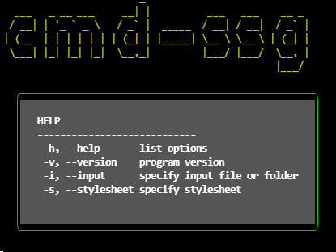

[Docusaurus blogging features](https://docusaurus.io/docs/blog) are powered by the [blog plugin](https://docusaurus.io/docs/api/plugins/@docusaurus/plugin-content-blog).

I recently networked with a new friend named Kevan Yang on slack in the first week.  He is a passionate developer just like me in OSD600 and I knew we would be partners in crime and all things open source.  I have reviewed his code and even though his code is more complete than mine, I found an issue running it.  It did not properly generate the corresponding HTML file.  He fixed the code by running it recursively through the files, which again I tested half a day later and it works!

I believe it all started on Tuesday of Week 1 when I had some of the code working, and I showed a demo of my code with libraries such as chalk, boxen, figlet to make decent look and feel to the command line tool as shown in the following.

Kevan knew my repo and before you know it he used the same library for creating the title.  I was able to get him started, but his stylesheet code conversely blew me away and I borrowed his module generateHtmlTemplate.js with properly citing it as his work.  That is the beauty of Open Source like this at Seneca.

Even if a project may not have a open source License file, it is still under exclusive copyright of the owner of the code.  In Kevan's case he has the proper license file and the readme is spot on with markdown just like mine.  It does not have typos or formatting issues.

At first we had issue installing each other's code because I was on node 14 and he was on node 16, but later I updated my version and things are running fine.  He has the proper version, help, input, and the html generated correctly and placed in the .dist/ folder.  Through communication on Slack and video call on discord we were able to successfully run each other's code.

His code at first was long and hard to understand but later in the week he fixed with much cleaner code.  I had my work cut of for me as I spent less time than Kevan on the code, but I learned a lot through the release of 0.1 because I used libraries I have never used.  It was interesting to see someone else's approach to the same problem.  I also checked out other people's repo in other languages like Rust and Python.  It was a fun journey in working with classmates on Slack.

My repo: https://github.com/ycechungAI/cmd-ssg

Kevan's repo: https://github.com/Kevan-Y/text-ssg

Cheers,

Eugene Chung

The blog supports tags as well!
