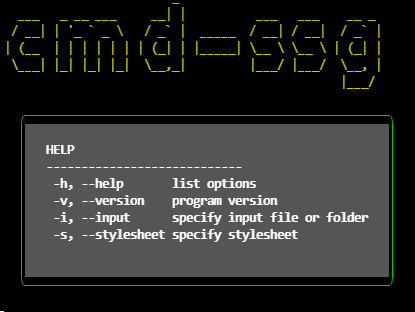

# cmd-ssg

deliverable 0.1 for OSD600 open source course at seneca

## Description: command-line-static site tool

```text
  VERSION    : 0.1.0
  Use        : Process input .txt or .md files into generated .html files.
```

## Prerequisite for development

```text
   "node": ">=16.9.1",
   "npm" : ">=7.23.0"

   if you are developing,
   run npm install
```

## Screen Shot



## How to Use

```text
git clone <this repo>

npm install -g . or npm install if you are just testing

ssgy <command option>    or    ./bin/index.js <command option> to be safe

Example Use:
ssgy -i examples
ssgy -i <file/folder with .txt or .md files> -s <stylesheet.css>

# If you don't like typing commands use json file
ssgy -c config.json
```

## FEATURES

1. cmd-ssg
2. github repo created
3. MIT license chosen
4. create README.md - keep it updated as you write your code, documenting how to use your tool, which features you include, etc. Your README file should tell users how to use your tool.
5. choose Javascript/Node.js language
6. running the tool with --version or -v flag will print the tool's name and current version
7. running the tool with --help or -h flag should print standard help/usage message also showing how to run the tool, which command line flags and arguments can be used, etc.
8. specify input file or folder with --input or -i
9. generate one .html output file for each input file
   NOTE : the original txt files should not be modified
10. need to deal with marking-up paragraphs: every blank line should be considered a paragraph limit and the text transformed into < p>
11. your tool should place all output into a ./dist folder by default
12. input can be deep within the files such as .\test\test2\
13. parse a title from your input files
14. adding -s stylesheet option
15. making it easy on the eyes
16. proper error message if incorrect file/folder inputs
17. accept a json file to pass options from the file

```text
Special Thanks  : Kevan Yang
Markdown Feature: Oliver Pham
Author          : Eugene Chung
```

## License

[MIT](https://github.com/ycechungAI/cmd-ssg-doc/blob/main/LICENSE)
